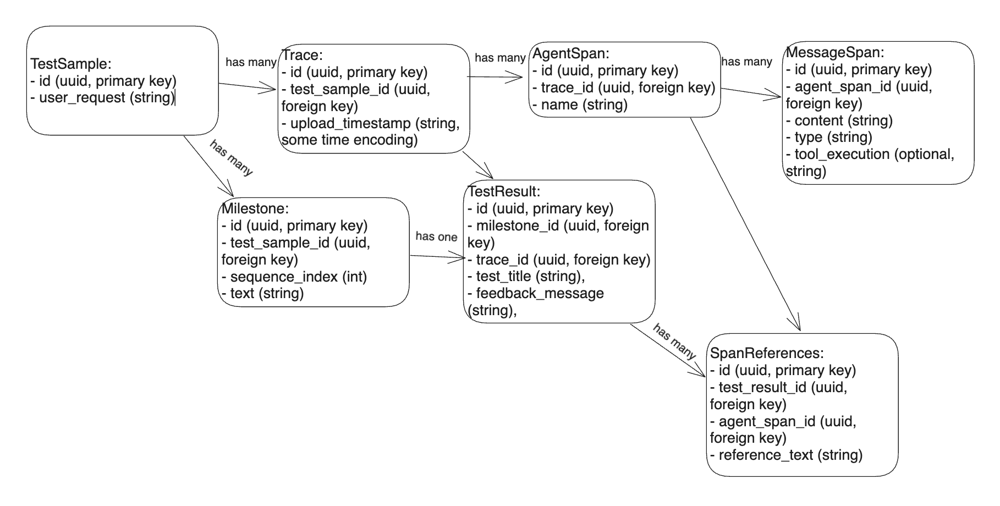

## How to Run

### Install Node Packages

To install the necessary packages, run:

```
npm install
```

### Run Development Server

To start the development server, run:

```
npm run dev
```

Then, open [http://localhost:3000](http://localhost:3000) in your browser to see the result.

### Run with Docker

Alternatively, you can run the application using Docker. The `Dockerfile` should work as expected.

## Project Structure

This project uses Next.js 14 with the new router logic. Below is an overview of the structure:

- **Backend**
  - `milestoneEvaluation.ts` - Functions for evaluating milestones against the traces.
  - `parseLangSmithTraces.ts` - Custom script for organizing and simplifying traces obtained from LangSmith.
- **App**
  - `upload` - Page for uploading traces. Files must be in `.json` format, with each file containing only one trace. Multiple files can be uploaded at once.
  - `dashboard` - The main page where users can inspect traces, add milestones, run tests, and inspect test results.

The database currently uses SQLite (temporarily for iteration). REST API endpoints for CRUD operations are located in the `*/api` folders. The current endpoints are preliminary and were generated using ChatGPT; they need to be rewritten using an ORM like Prisma.

## Backend Logic

To understand the backend logic, refer to the `runTests()` function in `src/backend/milestoneEvaluation.ts`. This function sequences the steps used to run tests, and the prompts are also located in this file.

## Database Structure

Here is the current database structure:



## TODO

- **Handling Multiple Test Runs**

  - Allow running tests multiple times on a single user request-trace pair. This is essential because the user should be able to upload a new trace and rerun the test or rerun the test for the same trace due to the stochastic nature of milestone tests.
  - Add a timestamp ID to the database tables `Trace` and `TestResult`. This is important for tracking Trace uploads and TestRuns over time. We will then be able to order them and show only the latest test run by default.
  - Add a dialog field where you can see timestamps of TestRuns and another one for Traces. Clicking on a specific dialog would load that test state.
  - Whenever an older TestRun/Trace is selected, there should be a badge indicating: “This is not the latest test run.”

- **Uploading New Trace for the Same User Request**
  - CORE FEATURE: The main point of the app is to enable Test-Driven Development (TDD). A key part of this is making iterative improvements to your code. User requests stay fixed, and the traces change as you update your code and rerun the agent.
  - Design how the UI & UX should look – create FIGMA sketches (to be done). Ideally, there would be a nice UI for expressing a timeline of traces as they were uploaded (left to right) and test scores for each.
  - What is the minimal MVP for this?
    - Create a dialog box for viewing older traces.
    - Implement an additional timeline plot that captures test evolution over time.
    - Consider how to handle the addition of milestones/tests over time. We can’t simply track percentage passed because as we add more tests, it may seem like performance has worsened, but tests might have simply gotten more rigorous.
    - For now, display absolute values: all milestones, milestones passed.
    - Perhaps each milestone could have its own color.
    - Alternatively, for each test run, we can show which milestones passed and which didn’t.
